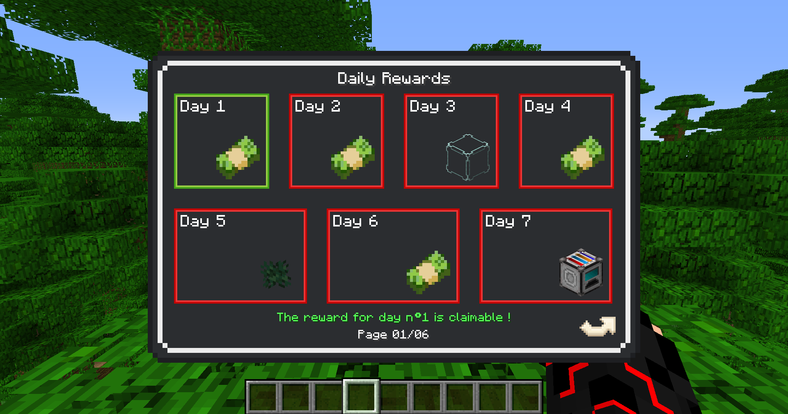
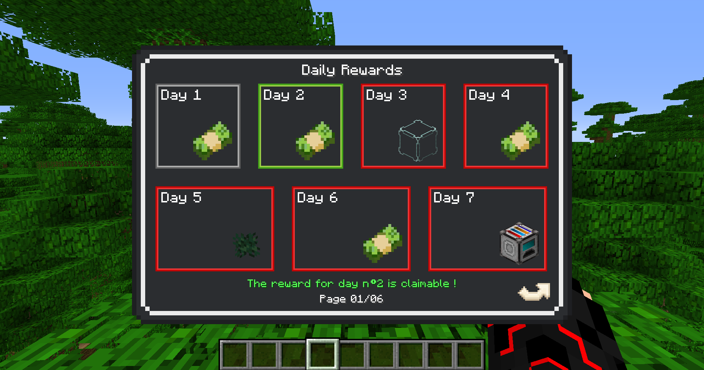
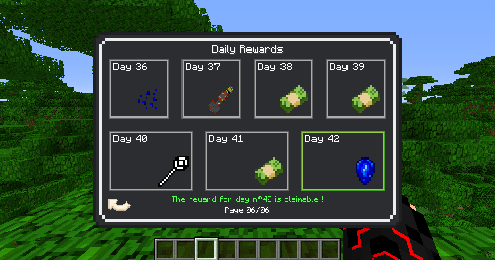

# 📆 Le DailyRewards

## <mark style="color:orange;">**Qu'est-ce que c'est que le DailyRewards ?**</mark>

Le _DailyRewards_ est un système assez populaire permettant de récompenser les joueurs qui se connectent régulièrement sur le serveur. Son instauration sur **EarthKingdoms** a été discutée pendant plusieurs mois, mais il est enfin là ! Son fonctionnement reste assez simple et intuitif, tout en présentant certaines subtilités.

<figure><figcaption></figcaption></figure>

## <mark style="color:orange;">**Comment fonctionne-t-il ?**</mark>

Chaque jour, les joueurs se connectant au serveur pourront profiter d’une récompense. Ils auront simplement à ouvrir l’interface du _DailyRewards_ en tapant la commande **/dailyrewards** ou en utilisant le raccourci clavier **P**. Les différentes couleurs associées à chaque jour indiquent ce qui est à collecter, ce qui a déjà été collecté et ce qui pourra être récolté par la suite.

En <mark style="color:$success;">**vert**</mark> ➡️ Prêt à être collecté, donc dépêchez-vous !\
En <mark style="color:$info;">**gris**</mark> ➡️ Déjà collecté, inutile d’essayer à nouveau.\
En <mark style="color:$danger;">**rouge**</mark> ➡️ Pas encore disponible, il faudra attendre un peu…

<figure><figcaption></figcaption></figure>

Chaque jour, vous aurez l’occasion de progresser dans votre _DailyRewards_, en commençant par le jour n°1 avec des récompenses plutôt simples, jusqu’au jour n°42 offrant des récompenses plus intéressantes.

Pour récupérer une récompense, il vous suffit de cliquer sur le jour correspondant : rien de plus simple !

## <mark style="color:orange;">Qu'est-ce qu'il se passe si je rate un jour ?</mark>

Lorsque vous récupérez une récompense, il n’est pas nécessaire d’attendre exactement 24 heures avant d’obtenir la suivante : il suffit simplement d’être le jour suivant. Par exemple, si vous collectez la récompense du jour n°1 aujourd’hui à 22h30, vous pourrez récupérer celle du jour n°2 dès le lendemain, entre 00h00 et 23h59.

S’il arrive que vous oubliiez de vous connecter et que vous manquiez un jour, vous devrez reprendre depuis le jour n°1. Alors tâchez de vous en souvenir, et d'allez jusqu'au jour n°42 !

<figure><figcaption></figcaption></figure>
